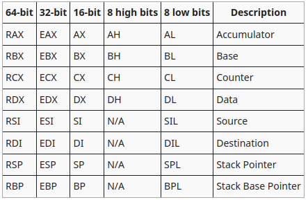

[felixcloutier](https://www.felixcloutier.com/x86/)

[osdev registers](https://wiki.osdev.org/CPU_Registers_x86)




La pila debe estar alineada a 16 bytes.

## Convención de llamada
  - En 32 bits, los parámetros se pasan pusheados a la pila de **derecha a izquierda**¹.
  - En 64 bits, los parámetros se pasan por distintos registros según su tipo:
  
    - Enteros y punteros se pasan por RDI, RSI, RDX, RCX, R8 y R9 (de **izquierda a derecha**²).
    - Flotantes se pasan por XMM0, XMM1, ... , XMM7 (de **izquierda a derecha**²).
    - Para todos los tipos, si se agotan los registros antes mencionados (hay más pero no forman parte de la convención, por ejemplo los XMM del 8 al 15), se pasarán por la pila pusheando de **derecha a izquierda**¹.
  - En 32 bits, el valor de retorno se espera en EAX.
  - En 64 bits, el valor de retono se espera en RAX, si es un entero o puntero, y en XMM0 si es un flotante.

## Registros volátiles y no volátiles

Vamos a dividir los registros entre
- ***no volátiles*** o ***callee-saved***: la función llamada debe encargarse de que, al terminar, estos registros tengan los mismos valores que al comienzo. Estos son:
  
  - En 64 bits: RBX, RBP, R12, R13, R14, R15.
  - En 32 bits: EBX, EBP, ESI, EDI
  
- ***volátiles*** o ***caller-saved*** : la función llamada no tiene obligación de conservarlos, si los quiere debe conservalos la función llamadora. 

Menciones especiales: 

- RSP/ESP se puede considerar como un registro no volátil dada su función específica como tope de la pila.
- R10 y R11 no están ni en el grupo de los registros por los que se pasan parámetros ni en el grupo de los registros no volátiles, no se olviden de su existencia.
- XMM8 a XMM15 no están en el grupo de los registros por los que se pasan parámetros pero están a disposición, no se olviden de su existencia.

## GDB

Instalación: https://github.com/cyrus-and/gdb-dashboard

``` shell
$ gdb <ejecutable>
```
``` gdb
>>> b <nombre_de_funcion>
>>> b <nombre_de_archivo>:<numero_de_linea>
```
``` GDB
>>> p $rcx  //imprime el contenido del registro RCX
>>> p *(uint32_t*)$rbp //castea el contenido de RBP como puntero a uint32_t, lo desferencia e imprime el contenido de la dirección de memoria
```

## Instrucciones utiles
``` assembly
movzx rdi, dil: zero-extends the 8-bit dil into rdi — good for unsigned values.

movsx rdi, dil: sign-extends the 8-bit dil into rdi — good for signed values.
```